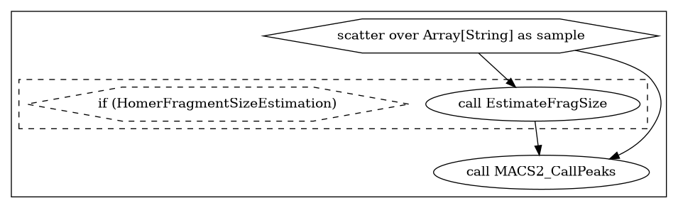

# Peak Calling

This workflow calls peaks on `BAM` files, with an optional fragment size estimation step.
## Parameters
An empty parameters file can be found at rnaseq_inputs.json. Some shared parameters between tasks are:
* `Dockerhub_Pull`: The path to the Docker image that will be pulled from Dockerhub and used to run the task.
* `cpu`: # of cores to use for the job
* `mem`: Memory in GB to use for the job (note: samtools uses per-core memory, and it is calculated during task runtime.)
```
"MACS2_CallPeaks.cpu": 4,,
"MACS2_CallPeaks.MACS2_CallPeaks.Bandwidth": 300,
"MACS2_CallPeaks.EstimateFragSize.Dockerhub_Pull": "faryabilab/homer:v1",
"MACS2_CallPeaks.MACS2_CallPeaks.p_value": ,
"MACS2_CallPeaks.q_value": 0.05,
"MACS2_CallPeaks.sampleList": "",              # Sample sheet made with `./make_bam_samplesheet.sh`
"MACS2_CallPeaks.MACS2_CallPeaks.Dockerhub_Pull": "faryabilab/macs2:0.1.0",
"MACS2_CallPeaks.paired_end": false,           # Did bams come from paired-end experiment?
"MACS2_CallPeaks.call_summits": true,
"MACS2_CallPeaks.mem": 8,
"MACS2_CallPeaks.EstimateFragSize.mem": 50,
"MACS2_CallPeaks.peak_type": "narrow",
"MACS2_CallPeaks.control_bam": "",             # Control bam file
"MACS2_CallPeaks.HomerFragmentSizeEstimation": true,
"MACS2_CallPeaks.EstimateFragSize.cpu": 12,
"MACS2_CallPeaks.genome_size": "hs"
```
