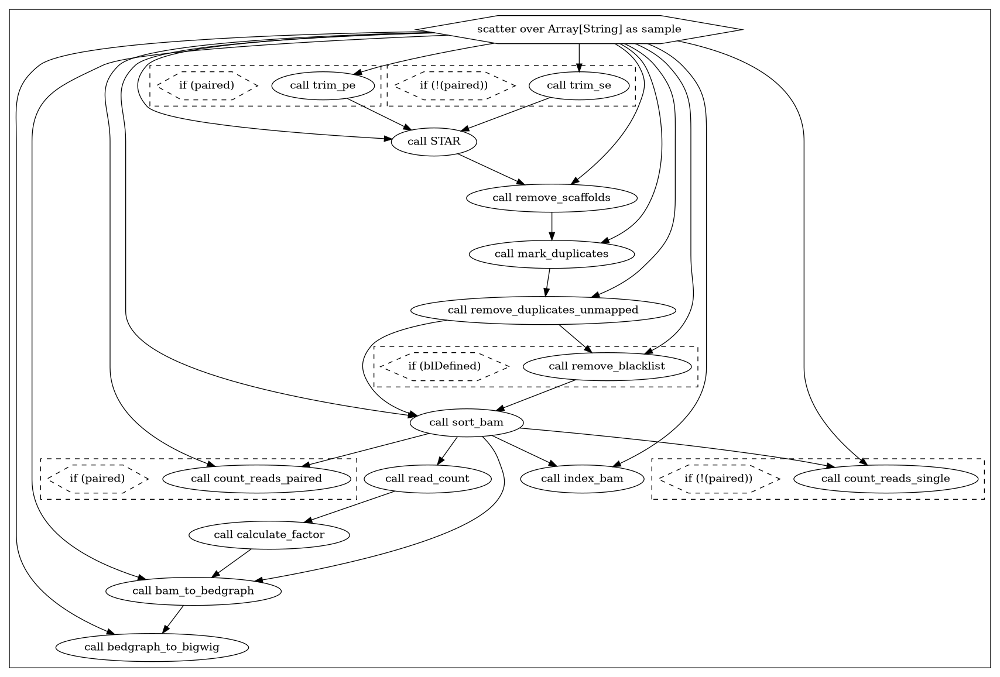

# RNA-seq

In addition to trimming, aligning, and filtering, the above workflow also calculates gene counts (`.counts`) for a specified `GTF` file.
## Parameters
Am empty parameters file can be found at `rnaseq_inputs.json`. Some shared parameters between tasks are:
* `Dockerhub_Pull`: The path to the Docker image that will be pulled from Dockerhub and used to run the task.
* `cpu`: # of cores to use for the job
* `mem`: Memory in GB to use for the job (note: samtools uses per-core memory, and it is calculated during task runtime.)
```
  "RNAseq.sampleList": "",              # Samplesheet made with ./make_samplesheet.tsv
  "RNAseq.paired": false,               # Is the sample paired? true=yes, false=no
  "RNAseq.chromNoScaffold": "",         # 3-column BED file with cannonical Chromosomes to keep and their beginning and end coordinates  
  "RNAseq.chromosome_sizes": "",        # 2-column file with cannonical chromosome sizes and their total sizes
  "RNAseq.GeneAnnotationFile": "",      # GTF file for gene counting
  "RNAseq.blacklist": "",               # (Optional) Blacklisted regions
  "RNAseq.star_index": "",              # Zipped STAR genome index made with ./zip_reference.sh

  --- Below this point parameters relate to command-level flags for each of the steps. Please do not remove any of them in the actual JSON file. ---

  "RNAseq.trim_pe.quality": 15,
  "RNAseq.trim_pe.stringency": 5,
  "RNAseq.trim_pe.length": 20,
  "RNAseq.trim_pe.e": 0.1,
  "RNAseq.trim_pe.illumina": true,
  "RNAseq.trim_pe.cpu": 8,
  "RNAseq.trim_pe.mem": 8,
  "RNAseq.trim_pe.Dockerhub_Pull": "faryabilab/trim_galore:0.10",

  "RNAseq.trim_se.quality": 15,
  "RNAseq.trim_se.stringency": 5,
  "RNAseq.trim_se.length": 20,
  "RNAseq.trim_se.e": 0.1,
  "RNAseq.trim_se.illumina": true,
  "RNAseq.trim_se.cpu": 8,
  "RNAseq.trim_se.mem": 8,
  "RNAseq.trim_se.Dockerhub_Pull": "faryabilab/trim_galore:0.10",

  "RNAseq.STAR.Dockerhub_Pull": "faryabilab/star:0.10",
  "RNAseq.STAR.STAR_cpu": 10,
  "RNAseq.STAR.STAR_mem": 50,
  "RNAseq.STAR.outSAMtype": "BAM Unsorted",
  "RNAseq.STAR.outSAMunmapped": "Within",
  "RNAseq.STAR.outFilterType": "BySJout",
  "RNAseq.STAR.outFilterIntronMotifs": "RemoveNoncanonicalUnannotated",
  "RNAseq.STAR.outSamAttributes": "Standard",
  "RNAseq.STAR.outSamstrandField": "intronMotif",
  "RNAseq.STAR.readFilesCommand": "zcat",
  "RNAseq.STAR.alignIntronMax": 100000,
  "RNAseq.STAR.chimSegmentMin": 25,
  "RNAseq.STAR.chimJunctionOverhangMin": 25,

  "RNAseq.sort_bam.Dockerhub_Pull": "faryabilab/samtools:0.1.0",
  "RNAseq.sort_bam.cpu": 12,
  "RNAseq.sort_bam.mem": 50,

  "RNAseq.index_bam.Dockerhub_Pull": "faryabilab/samtools:0.1.0",
  "RNAseq.index_bam.cpu": 12,
  "RNAseq.index_bam.mem": 50,

  "RNAseq.mark_duplicates.Dockerhub_Pull": "faryabilab/picard:0.1.0",
  "RNAseq.mark_duplicates.cpu": 12,
  "RNAseq.mark_duplicates.mem": 50,
  "RNAseq.mark_duplicates.PicardMetricsFile": "removeDuplicate_metrics.txt",
  "RNAseq.mark_duplicates.PicardValidationStringency": "SILENT",

  "RNAseq.remove_duplicates_unmapped.Dockerhub_Pull": "faryabilab/samtools:0.1.0",
  "RNAseq.remove_duplicates_unmapped.cpu": 12,
  "RNAseq.remove_duplicates_unmapped.mem": 50,

  "RNAseq.remove_scaffolds.Dockerhub_Pull": "faryabilab/samtools:0.1.0",
  "RNAseq.remove_scaffolds.cpu": 12,
  "RNAseq.remove_scaffolds.mem": 80,

  "RNAseq.remove_blacklist.Dockerhub_Pull": "faryabilab/bedtools:0.1.0",
  "RNAseq.remove_blacklist.cpu": 12,
  "RNAseq.remove_blacklist.mem": 50,

  "RNAseq.bam_to_bedgraph.Dockerhub_Pull": "faryabilab/bedtools:0.1.0",
  "RNAseq.bam_to_bedgraph.cpu": 8,
  "RNAseq.bam_to_bedgraph.mem": 50,

  "RNAseq.bedgraph_to_bigwig.Dockerhub_Pull": "faryabilab/bedtools:0.1.0",
  "RNAseq.bedgraph_to_bigwig.cpu": 12,
  "RNAseq.bedgraph_to_bigwig.mem": 50,

  "RNAseq.count_reads_single.Dockerhub_Pull": "faryabilab/bedtools:0.1.0",
  "RNAseq.count_reads_single.cpu": 12,
  "RNAseq.count_reads_single.mem": 50,
  "RNAseq.count_reads_single.AttributeType": "exon",
  "RNAseq.count_reads_single.GTFAttributeType": "gene_id",
  "RNAseq.count_reads_single.Stranded": "1",

  "RNAseq.count_reads_paired.Dockerhub_Pull": "faryabilab/subread:0.1.0",
  "RNAseq.count_reads_paired.cpu": 12,
  "RNAseq.count_reads_paired.mem": 25,
  "RNAseq.count_reads_paired.AttributeType": "exon",
  "RNAseq.count_reads_paired.GTFAttributeType": "gene_id",
  "RNAseq.count_reads_paired.Stranded": "1",

  "RNAseq.calculate_factor.Dockerhub_Pull": "faryabilab/bedtools:0.1.0",
  "RNAseq.calculate_factor.cpu": 1,
  "RNAseq.calculate_factor.mem": 5,

  "RNAseq.read_count.Dockerhub_Pull": "faryabilab/samtools:0.1.0",
  "RNAseq.read_count.cpu": 1,
  "RNAseq.read_count.mem": 5
```
